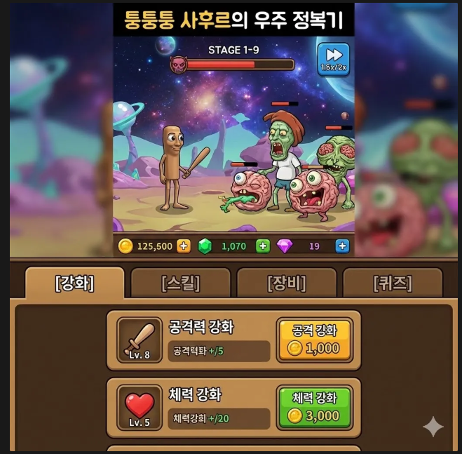
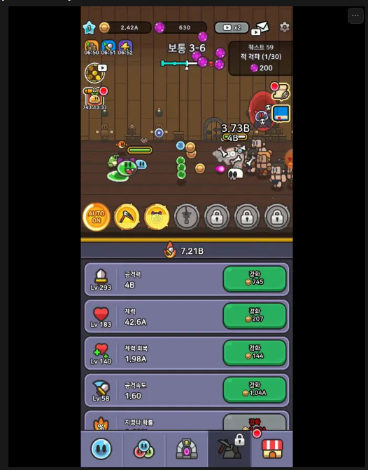

# 퉁퉁퉁 사후르의 우주 정복기 기획서

## 1. 프로젝트 개요
- **프로젝트명**: 퉁퉁퉁 사후르의 우주 정복기 (가제)
- **장르**: 방치형 RPG / 클리커 (Idle RPG)
- **엔진**: Unity 6000.0.60f1 (기반 기술 참조)
- **컨셉**: 이탈리안 브레인롯 캐릭터들을 무찌르며 우주를 정복하는 사후르의 모험

## 2. 게임 구성 및 UI
### 2.1. 메인 화면 (전투)
- **시점**: 3D 사이드 뷰
- **UI 스타일**: 레전드 오브 슬라임(Legend of Slime) 스타일 참조
- **하단 탭 구성**:
  1. **강화** (기본 성장)
  2. **스킬** (성장/퀴즈 보상)
  3. **장비** (성장/광고/인앱결제 보상)
  4. **퀴즈** (미니게임)

### 2.2. 게임 진행 (Core Loop)
- **스테이지 구성**:
  - 스테이지 배경은 행성 단위로 변경 (스테이지 하나가 행성 컨셉)
  - 10 스테이지마다 **보스 몬스터** 등장
  - 이전 스테이지 선택 기능 제공
- **전투 방식**:
  - 기본: 자동 전투
  - 터치: 화면 터치 시 사후르가 ‘퉁! 퉁! 퉁!’ 하며 추가 공격
- **게임 속도**:
  - 기본 1.5배속 무료 제공
  - 2배속: 실버 패스 구매 시 가능 (평생 3,900원)

### 2.3. 도감 시스템
- **몬스터 컬렉션**: 몬스터 처치 시 일정 확률로 도감에 등록 (메이플스토리 방식)
- **효과**: 도감 등록 시 능력치 향상

## 3. 컨텐츠 상세

### 3.1. 몬스터 및 레벨 디자인
- **웨이브 시스템**:
  - 한 스테이지당 3 웨이브의 일반 몬스터 출현
  - 4번째 웨이브: **엘리트 몬스터** (단, 10의 배수 스테이지는 **보스 몬스터**)
- **몬스터 레벨 공식**:
  - `(StageNum - 1) * 3 + (1, 2, 3)`
  - 예: 스테이지 1-1 → Lv 1, 2, 3 / 스테이지 1-2 → Lv 4, 5, 6
- **몬스터 타입**:
  - **일반**: 기본 몬스터 (이탈리안 브레인롯 캐릭터)
  - **엘리트**: 일반 몬스터 체력의 `10 + a`배. 제한시간 20초. (단순히 체력 많은 뚱뚱이)
  - **보스**: 일반 몬스터 체력의 `20 + a`배. 제한시간 30초. (스킬 패턴 보유)

### 3.2. 강화 시스템 (골드)
- **재화**: 골드
- **조작**: 버튼 홀드 시 가속 강화 (0.5초 → ... → 0.02초)
- **강화 등급 및 해금 조건**:
  - **일반**: 기본 해금
  - **슈퍼**: 총 레벨 합 5,000 이상
  - **울트라**: 총 레벨 합 15,000 이상
  - **슈퍼울트라**: 총 레벨 합 30,000 이상

#### 강화 항목표
| 구분 | 코드 | 업그레이드명 | 설명 | Stat |
| :--- | :--- | :--- | :--- | :--- |
| **일반** | UP001 | 공격력 | 공격력 증가 | ATK |
| | UP002 | 체력 | 체력 증가 | HP |
| | UP003 | 방어력 | 방어력 (%) | DEF |
| | UP004 | 회복력 | 초당 회복량 | HPREC |
| | UP005 | 공격 속도 | 공격 속도 비율 | ATKSP |
| | UP006 | 크리티컬 확률 | 크리티컬(200% 데미지) 확률 | CR |
| **슈퍼** | UP101 | 터치 시 공격력 | 터치 공격 추가 배율 (예: 100% → 2배) | ATKT |
| | UP102 | 최대 미접속 보너스 시간 | 기본 6시간에서 증가 | OFFT |
| | UP103 | 골드 획득량 증가 | 비율 단위 % | GOLDR |
| **울트라** | UP201 | 울트라 공격력 | 공격력 % 증가 | ATKR |
| | UP202 | 미접속 보너스 획득량 | 단위 % | OFFA |
| | UP203 | 슈퍼 공격 속도 | 단위 % | ATKSP |
| | UP204 | 쿨타임 감소 | 단위 % | RCD |
| | UP205 | 울트라 크리티컬 확률 | 크리티컬 배율 제곱 적용 (예: 200%^2 = 400%) | UCR |
| **슈퍼울트라** | UP301 | 방패 뚫기 | 방어율 무시 % | ATK |
| | UP302 | 보스 데미지 | 단위 % | IGNDEF |
| | UP303 | 크리티컬 데미지 | 크리티컬 배율 증가 | CD |
| | UP304 | 울트라 방어력 | 방어력 % | DEFR |

#### 강화 비용 공식
- 최대 4구간으로 구성, 구간별 비용 증가율 상이 (복리)
- **예시 (공격력 1구간 0~3000)**: `기본 비용 10 * 1.015^(레벨)`
- **비용 계산 예시 (Lv 25,000)**:
  - `10 * 1.015^3000 * 1.025^5000 * 1.04^7000 * 1.05^10000`
  - `≈ 1.39 * 10^405` (1.39EE)

### 3.3. 스킬 시스템 (에메랄드)
- **재화**: 에메랄드 (성장/퀴즈 보상)
- **획득**: 소환 (Gacha)
  - 1회 / 10회 / 35회 소환 지원
  - 연출 스킵 (바로 결과, 5배속)
  - **UGS Cloud Code** 활용 (서버 검증)
  - 소환 레벨 존재 (레벨에 따라 등급 확률 변경)
- **구성**:
  - 등급: F ~ A
  - 타입: 패시브 / 액티브
  - 장착 슬롯: 초기 1개 → 진행도에 따라 최대 5개 확장

### 3.4. 장비 시스템 (다이아몬드)
- **재화**: 다이아몬드 (성장/광고/인앱결제)
- **대상**: 무기 (몽둥이) 우선 구현
- **획득**: 소환 (Gacha) - 스킬 소환과 동일한 시스템 (UGS, 소환 레벨 등)
- **등급**: F ~ SSS3 (총 20단계, D~SSS는 세부 3단계)
- **성장 및 효과**:
  - **보유 효과**: 장비 획득 시 영구 적용 (장착 안 해도 적용)
  - **합성**: 하위 등급 4개 → 상위 등급 1개 (자동 합성 기능)
  - **강화**: 루비 사용. 레벨당 보유 옵션 20% 증가. (합성으로 소모되어도 강화 수치는 유지 - 도감형 강화)
  - **옵션**:
    - 기본: 공격력 증가
    - 고등급: 보유 옵션 2종 / 3종 (추가 옵션은 강화로 증가하지 않음)

### 3.5. 퀴즈 시스템 (티켓)
- **컨셉**: 이탈리안 브레인롯 캐릭터 이름 맞추기
- **입장 재화**: 티켓
  - 획득처: 스테이지 클리어, 패키지, 푸시 보상(출근/점심/저녁)
- **보상**: 난이도에 따라 차등 지급 (에메랄드 등)
- **광고 연동**:
  - 리워드 광고: 최고 기록으로 즉시 완료 처리
  - 인터스티셜 광고: 퀴즈 실패 시 부활 (보상 상향 적용)

## 4. 참조 이미지
| 메인 화면 | UI 예시 | 캐릭터 컨셉 |
| :---: | :---: | :---: |
|  |  |  |
